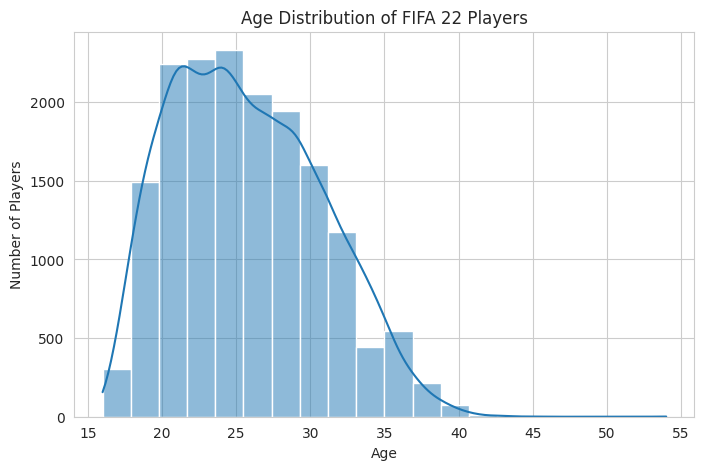
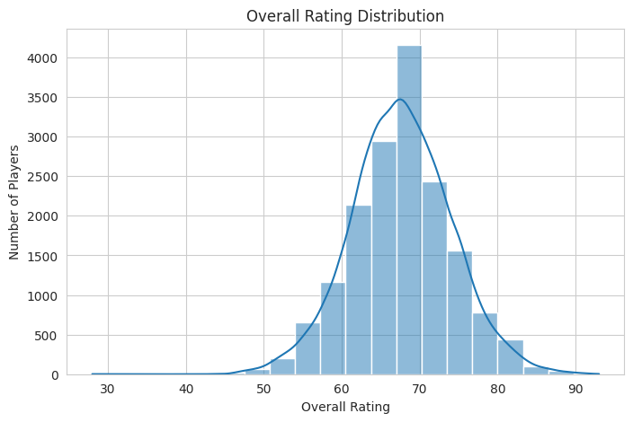
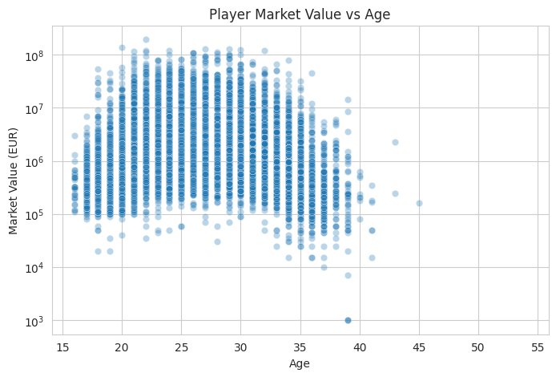
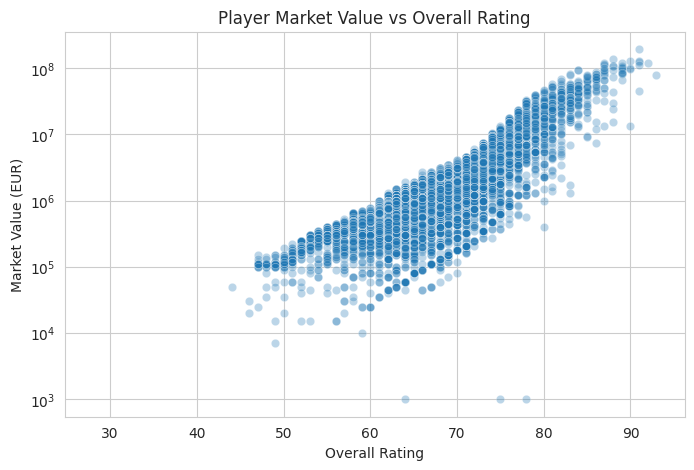
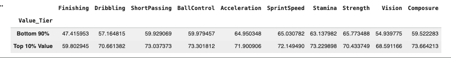
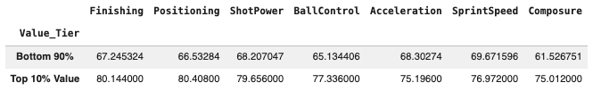
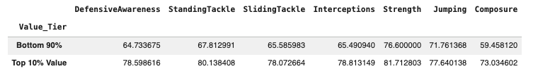
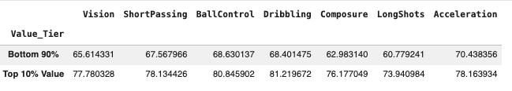
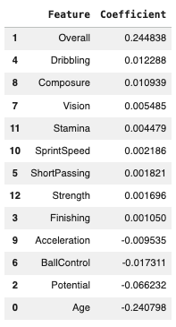

#  FIFA 22 Player Value Analytics

An end-to-end data analytics and modeling project that explores **what drives football player market value** using FIFA 22 player data. The project combines data preprocessing, exploratory data analysis (EDA), position-based comparisons, and interpretable predictive modeling to understand how age, performance attributes, and potential influence valuation.

---

## Dataset

- **Source**: [FIFA 22 Official Player Dataset (Kaggle)](https://www.kaggle.com/datasets/bryanb/fifa-player-stats-database?select=FIFA22_official_data.csv)
- **Observations**: ~16,700 professional players
- **Key Fields**:
  - Demographics: Age, Height, Weight, Nationality
  - Performance Ratings & Skill Attributes
  - Position Information
  - Market Value, Wage, Release Clause

A cleaned and standardized version of the dataset was created during preprocessing and used across all analyses.

---

## Exploratory Data Analysis (EDA)

### Age Distribution  
Player age follows a realistic distribution, with most players concentrated in early-to-mid career years.  
Market value peaks within a narrow age range and declines sharply after the prime window.

---

### Overall Rating Distribution  
Most players cluster around mid-level ratings, while elite ratings are rare, forming a small but highly valued segment of the market.

---

### Market Value vs Age  
Market value shows a **non-linear relationship** with age, motivating the use of log-transformed value in later analysis and modeling.

---

###  Market Value vs Overall Rating  
Player value increases disproportionately at higher ratings, indicating threshold effects rather than linear growth.

---

## High- vs Low-Value Player Comparison

Players in the **top 10% of market value** were compared against the remaining 90% to identify meaningful differences.

Key findings:
- High-value players consistently outperform in **technical attributes** such as dribbling, ball control, finishing, and passing
- **Mental attributes** like vision and composure show large gaps
- Physical traits matter, but act as supporting factors rather than primary drivers

---

##  Position-Specific Value Drivers

To account for role-based differences, analysis was conducted across the **three most represented positions** in the dataset:
- **Striker (ST)** – attacking value
- **Center Back (CB)** – defensive value
- **Attacking Midfielder (CAM)** – creative value

Rather than aggregating all players together, high- and low-value players were compared **within each role** to identify attributes that most strongly differentiate elite players.

### Strikers (ST)
High-value strikers significantly outperform others in finishing, positioning, ball control, and composure. While speed and shot power are also higher, the largest gaps are in goal conversion and decision-making, indicating that attacking efficiency matters more than raw athleticism.

###  Center Backs (CB)
For center backs, market value is driven primarily by defensive intelligence and reliability. High-value defenders excel in defensive awareness, tackling, interceptions, and composure, highlighting the importance of positioning, anticipation, and calm decision-making under pressure.

###  Attacking Midfielders (CAM)
High-value attacking midfielders show large advantages in vision, short passing, dribbling, ball control, and composure. These results emphasize creativity and technical control as key value drivers in advanced midfield roles.

Across all positions, **technical quality and composure consistently outweigh raw physical traits** in differentiating top-value players.

---

## Predictive Modeling

To complement the analysis, interpretable regression models were developed to estimate player market value.

### Models Used
- **Linear Regression** (with Overall rating)
- **Linear Regression** (without Overall rating)
- **Random Forest Regression**

Player value was modeled in **log space** to account for extreme skew and market dynamics.

---

### Model Comparison (High-Level)
- Linear models provide transparency and interpretability
- Removing Overall rating reduces accuracy but highlights individual skill contributions
- Random Forest improves performance by capturing non-linear effects and interactions

---

### Feature Importance (Random Forest)

Feature importance analysis highlights:
- **Potential and Age** as dominant drivers of value
- Technical and mental attributes (composure, finishing, dribbling, vision) as consistently influential
- Physical attributes playing a secondary role

---

##  Key Takeaways

- Player market value reflects a balance of **current performance, future potential, and role-specific skills**
- Age impacts valuation through strong non-linear effects
- Technical and mental attributes consistently separate elite players from the rest
- Performance data explains a meaningful portion of value, though real-world market factors remain outside model scope

---

##  Conclusion

This project demonstrates how structured exploratory analysis and interpretable modeling can be used to explain football player market value in a realistic, decision-focused manner. Rather than optimizing for prediction alone, the analysis emphasizes **interpretability, insight generation, and role-aware reasoning**.

The complete analysis, notebooks, and supporting code are available in this repository.

---

## Tools & Libraries

- Python
- Pandas, NumPy
- Data Visualization (Matplotlib, Seaborn)
- Exploratory Data Analysis (EDA)
- Scikit-learn (Linear Regression, Random Forest)

---

